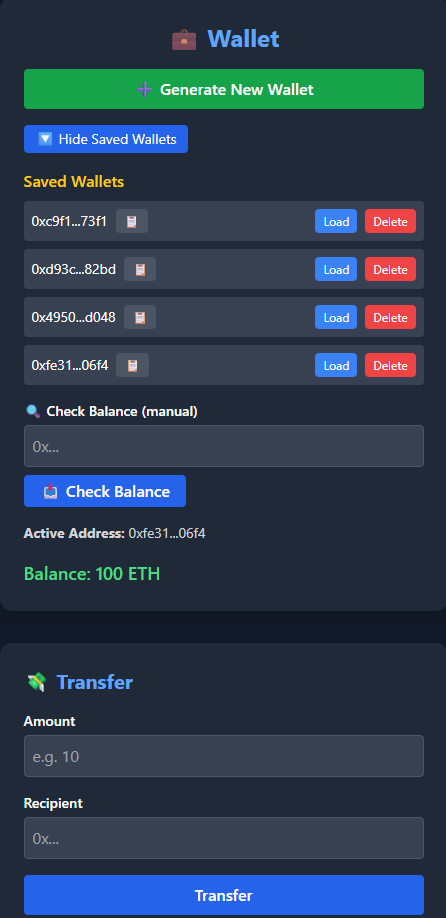
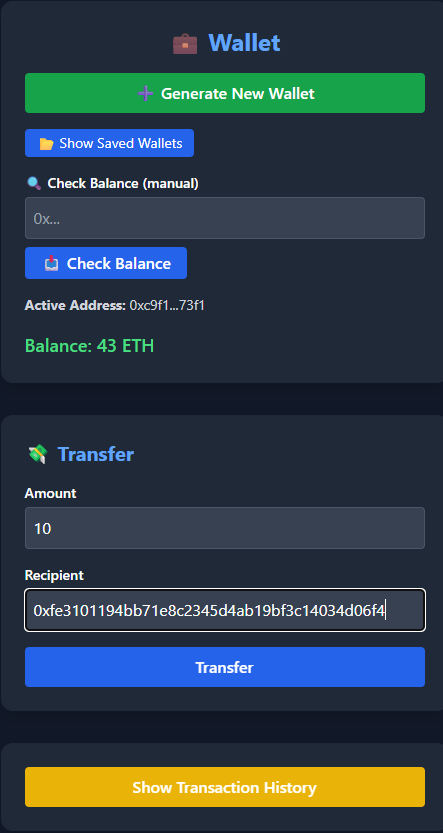
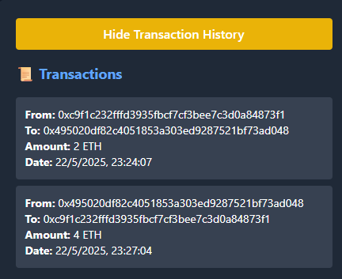

## Hi there 👋

<h1 align="center">Hi there 👋, I'm Albert Khudaverdyan</h1>

🔐 Aspiring Solidity Developer | 🌐 Based in Barcelona, Spain

---

## 🧠 About Me

I'm an **autodidact developer** with a strong interest in **blockchain technologies**, smart contract development, and decentralized applications (dApps). My mission is to build secure and efficient systems that empower people through decentralization.

I'm currently looking for **my first opportunity as a Solidity Developer**, where I can grow, learn and contribute to meaningful blockchain projects.

---

## 🛠️ Tech Stack

- **Languages**: JavaScript, TypeScript, Solidity
- **Frontend**: React, Tailwind CSS
- **Backend**: Node.js, Express
- **Blockchain**: Ethereum, Ethers.js, Hardhat
- **Tools**: Git, GitHub, Postman, VS Code

---

## 🚀 Highlight Projects

### 🔹 [ECDSA-Wallet](https://github.com/Hayk-1315/ECDSA-Wallet)
A simulated decentralized wallet built using cryptographic signing (ECDSA).  
Includes wallet generation, persistent balances with LowDB, secure transaction signing, and transaction history.

**Tech:** JavaScript, React, Ethereum-Cryptography, Node.js, Express, LowDB  
  
  

---

### 🔹 [Escrow App](https://github.com/Hayk-1315/Escrow-App)
A smart contract-based escrow service that allows safe transactions between two parties with a third-party arbiter.

**Tech:** Solidity, React, Ethers.js, Hardhat

---

## 🎯 Educational Value

Both projects reflect my ability to:
- Work end-to-end (frontend + backend).
- Apply **Solidity logic** to real-world problems.
- Use **digital signature verification (ECDSA)** and cryptographic hashing.
- Implement **persistent storage** (LowDB) for user wallets and balances.
- Follow **secure development principles**.

---

## 🚧 Future Improvements

- Fully migrate backend to a hosted database (e.g. MongoDB or Firebase)
- Add user authentication and encryption for localStorage
- Deploy Escrow Smart Contract to a testnet
- Improve UI responsiveness and accessibility

---

## ☁️ Deployment Plans

- 🔸 **Frontend** → Vercel  
- 🔸 **Backend** → Render or Railway (Express + LowDB)

---

## 📫 Let's Connect!

- 🔗 [LinkedIn](https://www.linkedin.com/in/albert-khudaverdyan-656902253)
- 🌐 [Portfolio Website](http://www.albertkh.com/)
- 🐱 [GitHub](https://github.com/Hayk-1315)

---

## 📝 License

This project is open-source under the [MIT License](LICENSE).

